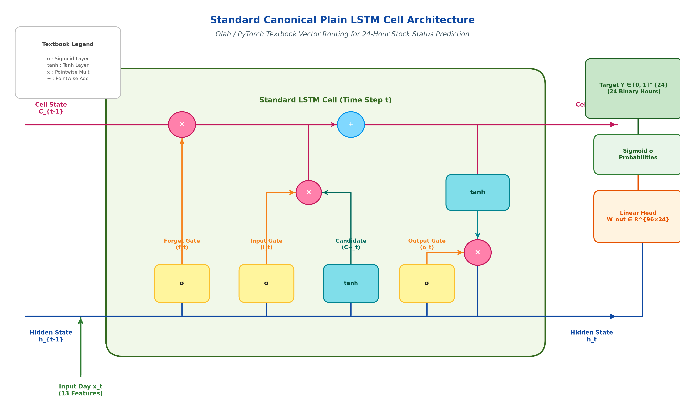

# Next-Day 24-Hour Stock Status Prediction: Canonical Plain LSTM Architecture

## Executive Summary
This report presents the canonical textbook architecture schematic of the **Plain Standard LSTM Cell** (based on Olah / PyTorch standards) integrated with a **24-Hour Binary Stockout Prediction Head** trained on the *FreshRetailNet-50K* dataset.

---

## 1. Canonical Textbook Plain LSTM Architecture Diagram

---

## 2. Standard Textbook Vector Routing & Internal Mechanics

### A. Cell State Vector Flow ($C_{t-1} \rightarrow C_t$)
* Running horizontally across the top of the cell:
  $$C_t = f_t \odot C_{t-1} + i_t \odot \tilde{C}_t$$
* **Forget Operation ($\otimes$)**: Point-wise multiplication of $C_{t-1}$ with forget gate vector $f_t$.
* **Input Operation ($\oplus$)**: Point-wise addition of the gated candidate state $i_t \odot \tilde{C}_t$.

### B. Hidden State Vector Flow ($h_{t-1} \rightarrow h_t$)
* Running horizontally across the bottom of the cell:
  $$h_t = o_t \odot \tanh(C_t)$$
* Combines previous step hidden state $h_{t-1}$ and current daily input feature vector $x_t$ into concatenated vector $[h_{t-1}, x_t]$.

### C. Four Internal Parallel Gate Layers
1. **Forget Gate ($\sigma$)**: Yellow layer box computing $f_t = \sigma(W_f \cdot [h_{t-1}, x_t] + b_f)$
2. **Input Gate ($\sigma$)**: Yellow layer box computing $i_t = \sigma(W_i \cdot [h_{t-1}, x_t] + b_i)$
3. **Candidate Cell State ($\tanh$)**: Teal layer box computing $\tilde{C}_t = \tanh(W_c \cdot [h_{t-1}, x_t] + b_c)$
4. **Output Gate ($\sigma$)**: Yellow layer box computing $o_t = \sigma(W_o \cdot [h_{t-1}, x_t] + b_o)$

### D. 24-Hour Stockout Prediction Head
* At final sequence step $L=14$:
  $$\hat{Y} = \sigma(W_{out} \cdot h_L + b_{out}) \in [0, 1]^{24}$$
* Output vector contains 24 binary probabilities corresponding to active operational store hours (6 AM to 10 PM).

---

## 3. Plain LSTM Specification & Performance

| Parameter / Metric | Empirical Value |
|:---|:---|
| **Recurrent Hidden Dimension ($h_{dim}$)** | 96 units |
| **Historical Sequence Window ($L$)** | 14 Days |
| **Input Feature Dimension ($d_{in}$)** | 13 features |
| **Total Trainable Parameters** | **44,952 parameters** |
| **Validation F1-Score** | **0.7852** |
| **Mean Absolute Error (MAE)** | **4.67 Hours** |

---

## 4. Master Artifacts
* **Publication PDF**: [docs/stockout_architectures_and_results.pdf](file:///Users/vibhorkumar/Desktop/codes/btp/docs/stockout_architectures_and_results.pdf)
* **High-Res Canonical Diagram Image**: [docs/images/plain_lstm_architecture_diagram.png](file:///Users/vibhorkumar/Desktop/codes/btp/docs/images/plain_lstm_architecture_diagram.png)
